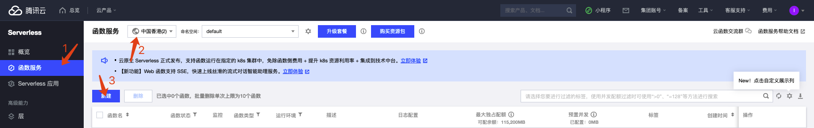
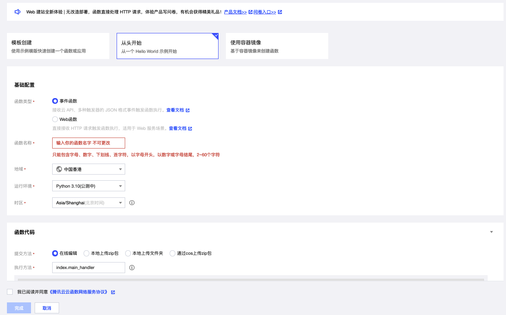

在今年早些时候我就有打算使用 webhook 对机器人进行优化，当时也打算使用 serverless 进行优化，但是当时可能由于代码或者环境的问题，延迟无法接受。鉴于毕设打算使用 serverless，打算用这个项目练练手。

<!-- more -->

## Webhook

直接翻译就是一个钩子，hook 的概念并不陌生，简单来说，就是在机器人收到消息的时候，服务器会向指定的地址发送一个 POST 请求。我们的程序需要做的就是对这个请求进行处理。

### 对比传统 pull 模式

传统的 pull 模式是通过部署在服务器上的监控程序，定时向服务器发送请求，查询是否有新的消息。显然这种比较消耗资源。

## Serverless

Serverless 是最近流行的一种云计算模式，相比起传统的服务器，无服务致力于让开发者专注于开发，而不需要关心服务器的维护。Serverless 的服务器不是我们关心的，我们只需要提供函数，云服务商会按照设定，给函数分配资源。

### Serverless × Tgbot

为什么有这种想法呢？当然是因为大陆的特殊性啦，每次部署服务器，你先要部署 clash 内核，然后通过设置代理，才能使机器人正常运行。就算使用 webhook，网络问题也无法避免。

当然可以使用外区的服务器，但是这种服务器价格往往比较高，而且只为了一个机器人不值得，机器负载一直特别低，暴殄天物。而 Serverless 可以自由选择地域，而且价格没有差别。至于费用，现在还没有直观的感受，还在使用新用户的三个月免费额度，如果控制在月租 10 元以内就可以接受。

而且在使用过后我才发现 Serverless 的另一个好处，就是出错后不会影响其他内容。传统的服务端程序，一旦出现错误没有 catch 或者 core 以后，就会直接崩溃，反应为 bot 下线。然后我们就需要重新上线重启程序。而对于每次 webhook 通知都是重启一个示例运行，因此互相不影响。

## 命令开发

云服务商使用的是腾讯云，~~开启工资回收计划~~。但是不得不说腾讯云太容易上手了，示例和文档比较清晰，个人开发者比较好上手。

### 启用 webhook

首先你需要有一个机器人，这个向 [@BotFather](https://t.me/BotFather) 申请就可以。按照指引进行申请，成功后你会得到一个 `Token`，这个相当于机器人的密码，拥有就可以控制机器人，**请妥善保管**。

然后我们通过调用 api 来开启 webhook。参考[官方文档](https://core.telegram.org/bots/api)，所有 `api` 都是按照如下方式鉴权调用的。

```text
https://api.telegram.org/bot<token>/METHOD_NAME
```

我们可以看到 [setwebhook](https://core.telegram.org/bots/api#setwebhook) 接口，通过调用这个接口启用 webhook。你可以直接询问 ChatGPT，这样事半功倍。

```bash
#!/bin/bash

# 替换以下变量为你的Telegram Bot Token 和 Webhook 地址
TELEGRAM_BOT_TOKEN="your_bot_token"
WEBHOOK_URL="your_webhook_url"

# 设置Telegram Bot Webhook
wget --method=POST \
     --header="Content-Type: application/json" \
     --body-data="{\"url\": \"$WEBHOOK_URL\"}" \
     "https://api.telegram.org/bot$TELEGRAM_BOT_TOKEN/setWebhook"

# 输出执行结果
echo "Webhook 设置完成。"
```

其他参数可以根据需要开启。

### 创建云函数

进入控制台，选择一个非大陆区域，然后新建一个事件函数。`web` 函数要求监听 `9000` 端口，而 `tgbot` 不支持。



基本设置，下方有个日志配置记得开启，否则会很难调试。



### 编写代码

Echo 几乎是每一个 ChatBot 的第一个功能了，但是这是一个最基础的，完成了这个，举一反三就没有其他问题了。

```python
def main_handler(event, context):
    # 对 webhook 进行鉴权
    if event['headers']['x-telegram-bot-api-secret-token'] != os.getenv('telegram_bot_api_secret_token'):
        return "Api auth failed"
    print("Received event: " + json.dumps(event, indent = 2))
```

第一部分是对 `webhook` 进行鉴权，`main_handler` 是函数的入口，`event` 包含了请求的消息，`context` 包含了这次运行的示例信息。鉴权是必要的，因为这个接口是暴露在公网的，所以只要获取到函数链接就可以调用。这里防止被其他人使用。（不应该把密码等信息显式编码在代码中）。这里把 `event` 打印出来，对于开发新的命令也有帮助。

```python
# def main_handler(event, context):
		tele_token = os.getenv("tele_token")
    if not tele_token:
        return "No tele_token found"

    bot = telebot.TeleBot(tele_token)
    update = json.loads(event['body'].replace('\"', '"'))
    message = update['message']

    # 命令处理器
    if bot and message['entities'][0]['type'] == 'bot_command':
        bot = telebot.TeleBot(tele_token)
        ret, msg = command_handler(message, bot)
        if ret == 0:
            return(msg)
        print(bot.get_me())
    return("Received message: " + json.dumps(message, indent = 2))
```

后面就是常规的处理了，注意的是 `json` 格式中的所以双引号都被转义了，需要替换回来。

## 使用 Docker 镜像创建云函数

这个的应用场景是我的毕设需要使用的，在线评测系统需要使用 docker 隔离评测环境，因此我们需要使用构建一个镜像用于启动。最近应该会完善和上传，感谢您的阅读。
